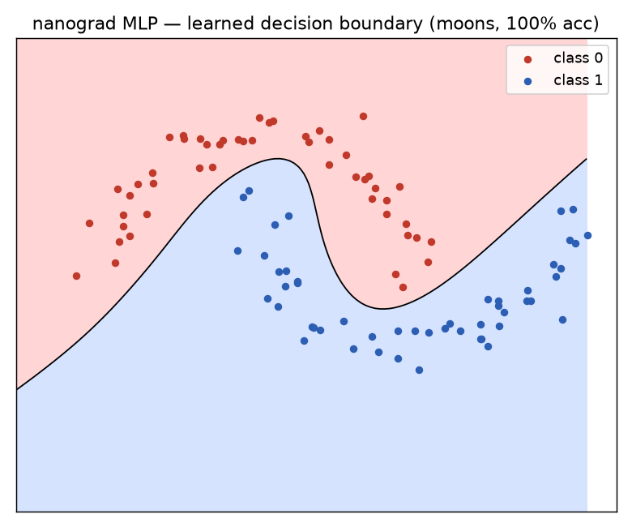

# nanograd

A tiny **reverse-mode automatic differentiation** engine and neural-network
library, in pure Python — no NumPy, no PyTorch in the core. The engine is one
file (~150 lines) you can read end to end, and it is enough to train a small
multi-layer perceptron with real backpropagation.

It answers the question every deep-learning framework hides behind C++ kernels:
**how does `.backward()` actually work?**

## The idea in 30 seconds

Every number is wrapped in a `Value` that remembers the operation that produced
it. Maths on `Value`s builds a graph; `.backward()` walks that graph in reverse
(topological order) and applies the chain rule once per node:

```python
from nanograd import Value

a = Value(-4.0)
b = Value(2.0)
c = a * b + b**3        # build the graph
c.backward()            # apply the chain rule

a.grad   # 2.0   = dc/da
b.grad   # 8.0   = dc/db  (= a + 3*b^2)
```

Same mechanism as PyTorch's autograd — just small enough to fit in your head.

## Train a network (real output)

Separate two interleaving half-moons — a non-linear problem a straight line
cannot solve:

```bash
python -m examples.train_moons
```

```
parameters: 337
step   0  loss 0.7550  acc 74.0%
step  10  loss 0.2153  acc 91.0%
step  20  loss 0.0903  acc 97.0%
step  40  loss 0.0378  acc 100.0%
step  90  loss 0.0147  acc 100.0%
final accuracy: 100.0%
```

The learned decision boundary (`python -m examples.plot_boundary`):



## What's inside

| File | What it shows |
|------|---------------|
| `nanograd/engine.py` | The `Value` autograd graph: `+ * **`, `relu/tanh/exp`, reverse-mode `backward()` |
| `nanograd/nn.py` | `Neuron` / `Layer` / `MLP` mirroring the `torch.nn` API |
| `examples/train_moons.py` | A full SGD training loop on a generated dataset |
| `examples/plot_boundary.py` | Renders the learned decision boundary |
| `tests/test_engine.py` | Analytic gradients checked against numerical finite differences |

## Tests

```bash
pip install pytest
pytest -q          # 4 passed
```

The key test (`test_matches_numerical`) verifies the engine's gradients agree
with central-difference numerical gradients — the standard proof that an
autograd implementation is correct.

## Why I built it

I work on computer-vision systems where the training stack is PyTorch. This is
the from-scratch reference I keep to reason about gradient flow and why a given
loss does or doesn't train. Inspired by Andrej Karpathy's micrograd;
re-implemented with extra activations, a numerical-gradient test suite, and a
dependency-free training example.

## License

MIT — see [LICENSE](LICENSE).
